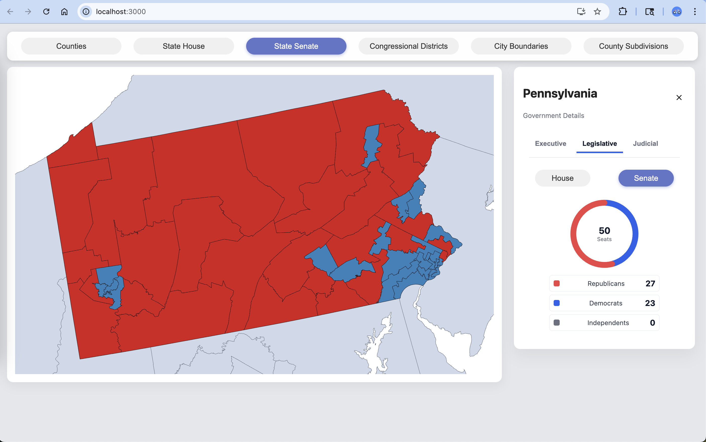
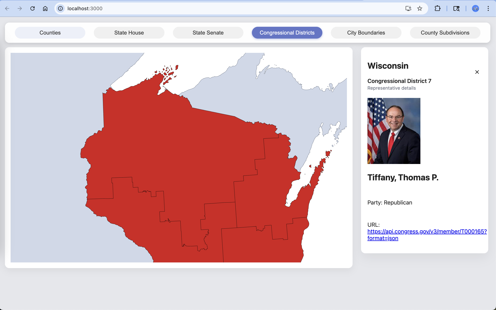

# Civic Mapper
[](https://creativecommons.org/licenses/by-nc-nd/4.0/)

## Description

Full stack application displaying elected officials across the US. Currently shows an overview of Federal Legislative Branch, each states federal representatives and each state's legislative branch.

***DISCLAIMER***
This app is not to be viewed as a source of truth, but a broad overview of the current representative makeup across America. This app uses the Open State's API which does not contain 100% of state officials. Many recent elections/special elections are slow to update, and thus there may apear to be vacancies where there are not at the state level, or a state's chamber may be missing a seat or two in it's proper count. This app is still a work in progress and hopes to fill these gaps, but currently they are plentyful. 

## Table of Contents 

- [Requirements](#requirements)
- [Installation](#installation)
- [Screenshots](#screenshots)
- [Usage](#usage)
- [Credits](#credits)
- [Future-Development](#future-development)
- [License](#license)

## Requirements

Currently not deployed. In order to run locally you will need Node, Python, a Congress API Key (free) and an Open States API Key (free).

- [Register for Open States API Key](https://open.pluralpolicy.com/accounts/profile/)
- [Register for Congress API Key](http://api.congress.gov/sign-up/)

## Installation

To setup locally:

Setup Frontend
```bash
cd client
npm i
```

Setup Backend
```bash
cd server
python -m venv venv
source venv/bin/activate
pip install -r requirements.txt
```

Add API Keys to env file
```bash
cd server
touch .env
```

Run the app from Root
```bash
npm run dev
```

## Screenshots







## Usage

Initially the app will load federal legislative makeup, with the ability to click on any state to see that state's federal representatives (both house represenatives and senators).

At any point you can change the map data you want to see in the top header. You can currently view a given states lower chambers disticts (house of representatives) as well as any states upper chamber districts (senate), and of course federal congressional districts.

You can also view city boundaries, counties and sub-counties, though there is currently no representative data or polling attatched to these maps.

Within any of the congressional district maps, state senate maps, or the state house maps, you can click on any given district to view the representative. Currently not all representatives are tracked by the open states api that is being utilized due to recent special elections, vacancies or other reasons. 


## Credits

- [Open States API](https://docs.openstates.org/api-v3/) -> A great open source API to get state officials for each state accross America. (Some officials are missing or slow to update)

- [Congress API](https://www.congress.gov/help/using-data-offsite) -> Government owned API to get congressional representative data; both house and senate. Not the most descriptive data when it comes to each representative but provides the basics.

- [Census Maps API](https://www2.census.gov/) -> One of many census apis that provides map data. Only provides ShapeFile data which is not the most friendly to work with in most modern frontend languages.

- [Geopandas File Reader](https://geopandas.org/en/stable/docs/reference/api/geopandas.read_file.html) -> A great python library that provides the means to translate census shapefiles into a more readible, modern GeoJSON format, which works well with all modern frontend mapping tools. 

- [D3 Map Projections](https://d3js.org/d3-geo/conic#geoAlbersUsa) -> D3 has multiple node packages which are utilized on the react frontend to display the census map data. Particularly the geoAlbersUsa projection is great to view the US as a better shape, having Alaska and Hawaii just under the rest of the states.

## Future-Development

This app is still in early development so there is much to be done:

- Add all territories to the map for better clarity and understanding of entire makeup of the USA.

- Polish Execute Branch data. Currently only some executive branch data is implemented for each state, not federal. However there are plenty missing governors, and even more missing officials such as secretaries of state, lieutenant governors and attorney generals.

- Implement Judicial Branch overview. Not as important as executive branch officials, but would be nice to give users insight into local, state and federal judges.

- Attatch data to alternative maps already available. Counties, subcounties and city divisions are difficult and it may not be possible to implement all local governments and officials, but at the very least polling data should be added to county divisions as that data is more accessible.

- Allow users to search by address for a list of all their representatives. This should be fairly simple to implement with the help of google maps api to convert an address into geographical coordinates and to get a list of districts that contain those coordinates.

- Add more data to the app beyond just representative data. There is space below the map that might showcase recent or important bills passed by a given government or representative. There are plenty of APIs to assist in this, but it would take extensive logic to implement and time to make the UI clean and proffesional.

- Increase map and data caching logic efficiency. Currently the python API makes a lot of external call, which can take excessive amounts of time to complete. There is already some caching logic implements, but it is a bit boiler-platey. Better organization and concurrency of map data to representative data would be great. A great implementation would be to pre-cache a the state's map data that the current user is located it, as it's the most likely to be visited and explored by that user. 

- Better user navigation across different map districts. There currently is not a way to go back to the federal representative overview, other than reloading the page.

- Implement unit testing across the app. Currently the app has no tests and that should really be addressed as the logic expands.

- Deploy the app through AWS or Azure.

## License

This project is licensed under the **Creative Commons Attribution–NonCommercial–NoDerivatives 4.0 International (CC BY-NC-ND 4.0)** license.

This means you are free to:

- **Share** — copy and redistribute the material in any medium or format

Under the following terms:

- **Attribution** — You must give appropriate credit.  
- **NonCommercial** — You may not use the material for commercial purposes.  
- **NoDerivatives** — You may not modify or build upon the material.  

For full license details, see the official legal code:  
https://creativecommons.org/licenses/by-nc-nd/4.0/legalcode
